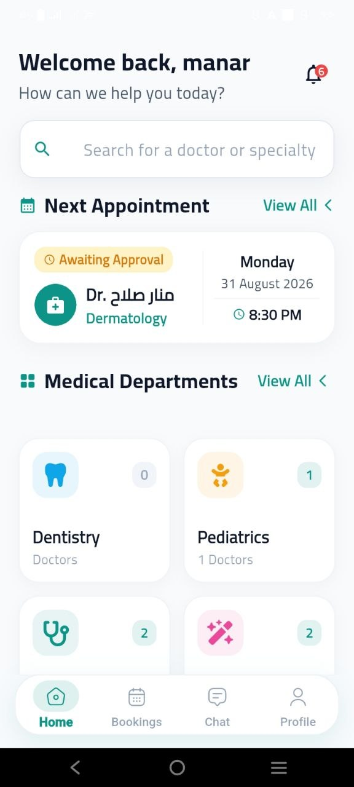
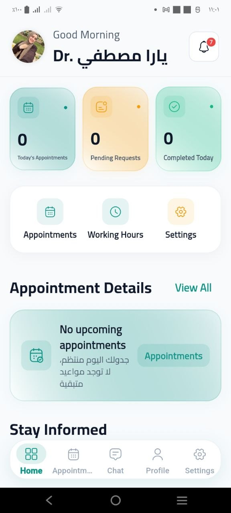
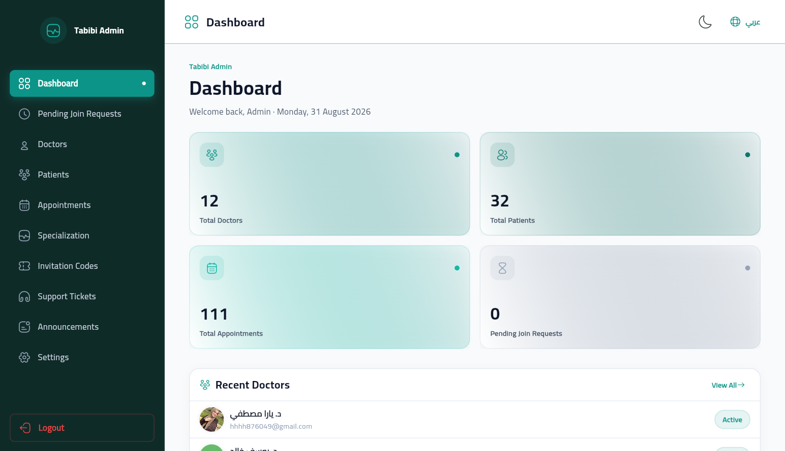
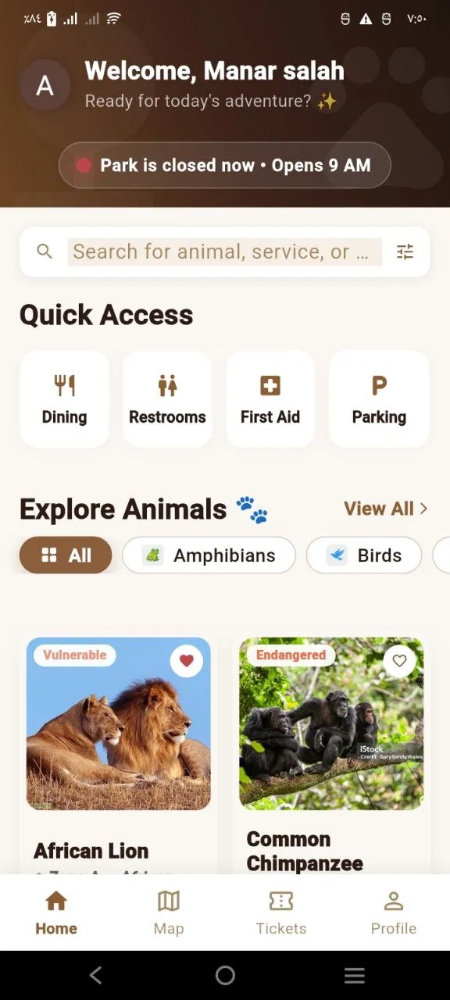
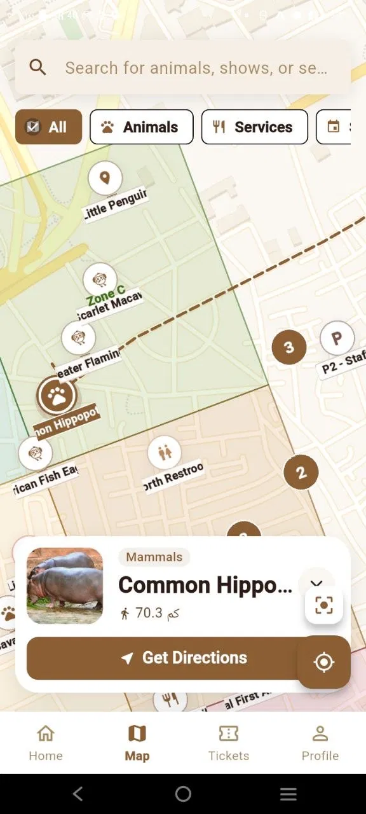
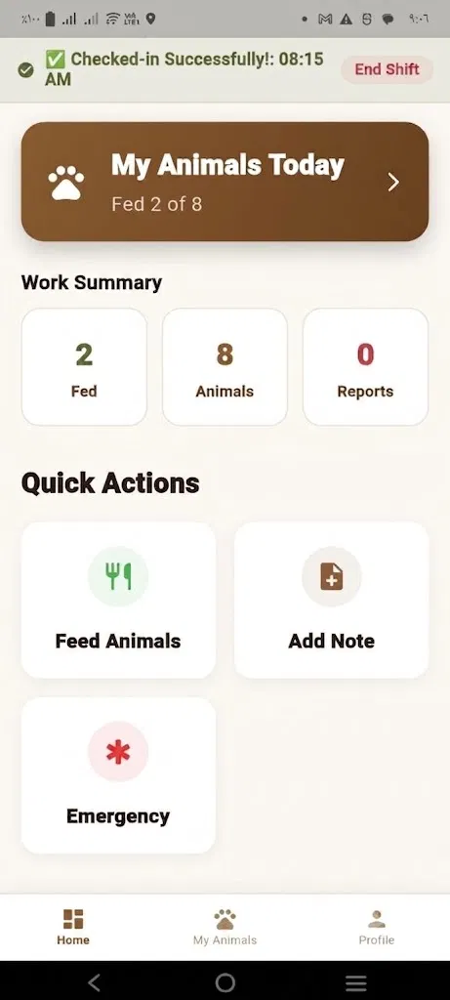
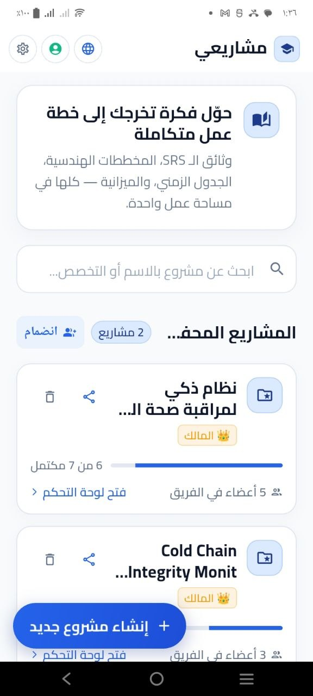
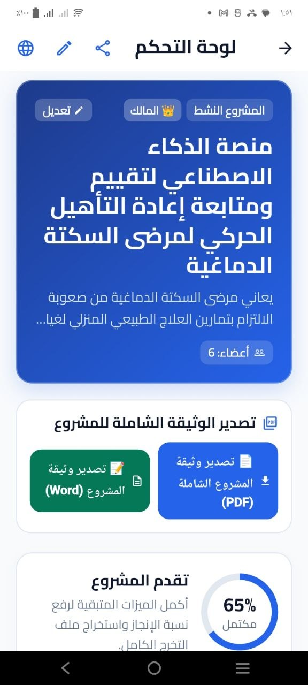

# 📱 Manar Salah — Flutter & Mobile Engineer

  
  
  

  <b>Production-Grade Mobile Apps • Multi-Role Systems • Clean Architecture • Offline-First</b>

---

## 🌟 Overview

Welcome to the repository of my personal portfolio website! This site showcases my engineering work, architecture decisions, and production-grade applications built with **Flutter & Dart**.

🔗 **Live Website:** [https://portfolio-d19p.vercel.app/](https://portfolio-d19p.vercel.app/)

---

## 🚀 Featured Projects

### 1. 🩺 Tabibi — Multi-Role Healthcare Ecosystem
A comprehensive healthcare platform connecting patients, physicians, and clinic administrators into a single unified mobile experience.
* **Three Dedicated Roles:** Patient (teleconsultation, booking, records), Doctor (prescriptions, EHR), Admin (clinic management, staff invites).
* **Architecture:** Clean Architecture with BLoC state management and offline-first encrypted sync.
* **Highlights:** End-to-end appointment lifecycle, real-time messaging, HIPAA-conscious medical history security.

  
  
  

---

### 2. 🦁 Zooverse — Smart Wildlife Park & Zoo Operations
An integrated IoT & operations ecosystem powering zoo visitor discovery and operational workflows.
* **Visitor Experience:** Interactive park navigation, ticket booking, animal discovery guides.
* **Staff & Admin Operations:** Gate ticket scanning, animal welfare tracking, automated keeper summaries.
* **Highlights:** Smooth micro-animations, offline ticket verification, resilient real-time status.

  
  
  

---

### 3. 🎓 Smart Graduation Projects Portal
A platform streamlining university graduation projects, thesis approvals, and faculty milestone evaluations.
* **Role-Based Workflow:** Students submit project stages; advisors review and grade against deadline rubrics.
* **Milestone Tracking:** Real-time progress bars, document versioning, and committee notifications.

  
  

---

## 🛠️ Technical Stack & Skills

* **Core Framework:** Flutter (iOS & Android), Dart
* **Architecture:** Feature-first Clean Architecture, Repository Pattern, SOLID Principles
* **State Management:** BLoC / Cubit, Provider
* **Networking & APIs:** RESTful APIs, WebSockets, Dio, GraphQL, Gemini AI Integration
* **Local Storage & Sync:** Hive, Isar, Encrypted SharedPreferences, Offline-first sync
* **Backend Integration:** Firebase (Auth, Firestore, FCM), Supabase, Node.js backends
* **CI/CD & Testing:** Unit Testing, Integration Tests, GitHub Actions, Vercel

---

## 📬 Contact & Connect

* **Portfolio:** [portfolio-d19p.vercel.app](https://portfolio-d19p.vercel.app/)
* **LinkedIn:** [linkedin.com/in/manar-salah-8125052ab](https://linkedin.com/in/manar-salah-8125052ab)
* **Email:** [manarsalah09872@gmail.com](mailto:manarsalah09872@gmail.com)
* **WhatsApp:** [+20 110 905 7028](https://wa.me/201109057028)
* **Location:** Cairo, Egypt 🇪🇬 *(Available for Remote Opportunities Worldwide)*

---

  Designed & Developed with care by Manar Salah © 2026

